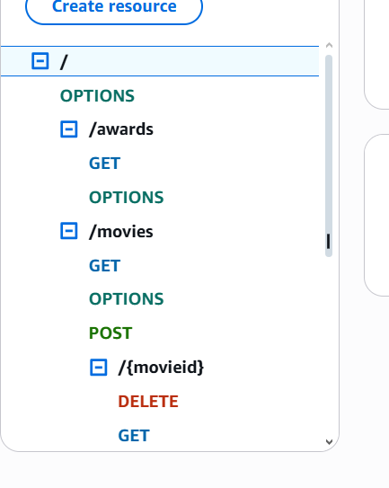
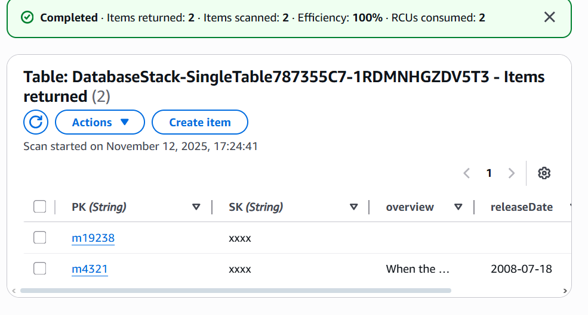
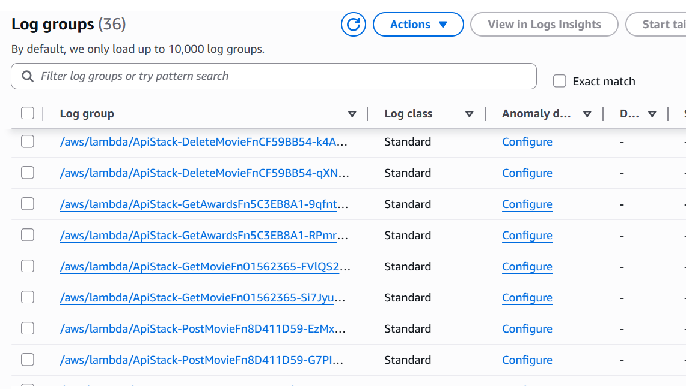

## Assignment - Cloud App Development.

__Name:__  Alexandra Dinea

### Links.
__Demo:__ https://youtu.be/ntk75g-HxWk

### Screenshots.

Web App API, as seen from the AWS management console.

Seeded DynamoDB table

CloudWatch state change logger logs, from real modify events to generate logs

###  Extra 

- The application defines reusable constructs (AuthApi, AppApi) to encapsulate and modularize API Gateway + Lambda logic
- The StateChangeLogger function automatically processes DynamoDB stream events to log data modifications, implementing an event-driven pattern that triggers when modifications are made to the table
- The architecture is divided into multiple stacks (DatabaseStack, LoggingStack, CognitoStack), showing inter-stack references using CloudFormation outputs and dependencies
- Each Lambda automatically logs execution data in a seperate logging group, with the gateway that centralizes logging
- Environment variables are dynamically injected into Lambda functions, and minimal IAM permissions are granted (ie. allowing Lambda read/write access to DynamoDB only where it is required)
